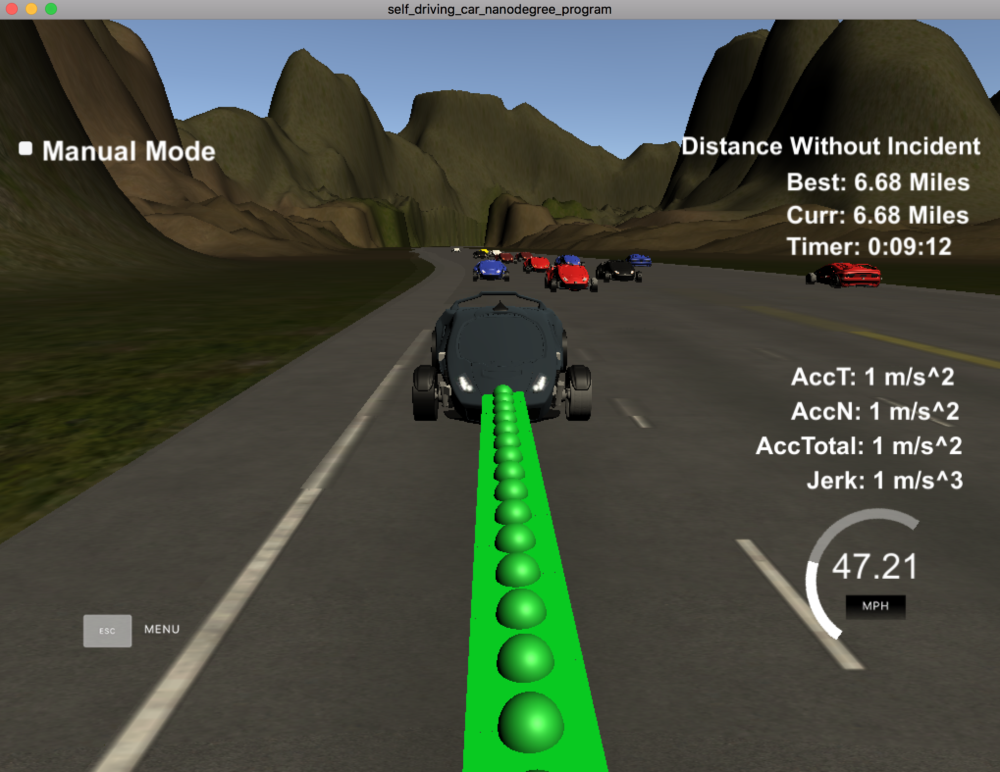

# CarND-Path-Planning-Project
Path planning for Self-Driving Car on virtual highway.

## Compilation
One additional file Spline.h has been added to to the source repository.

## Validation
The car ran without any incident for more than 5 miles without any incident. This confirms that the care is within the speed limit, without unacceptable jerk and collision.

## Description
The car was controlled using 3 basic steps - identify the obstacles on the path, plan action according to obstacle and target, actuate the vehicle with the parameters.

### Obstacles on the path
From the sensor fusion data identify the vehicle that we care about. We only care about the vehicle ahead, on the left, and on the right. We don't care about the vehicles behind. This is identified using the d and s of Fernet coordinates.

### Action Plan
Action plan depends on the target speed, acceptable jerk, obstacles on the road, and preferrable to stay in the middle lane. One approach is to start assuming that the car can drive on the lane, can go to left lane and also can go to the right lane. Then eliminating what is not possible based on the constraint. I used this simple approach for path planning.

To avoid collision, I calculate the expected trajectory for each identifided obstacle. If the obstacle is within 30, we avoid moving to the obstacle's lane. It applies to all the lanes.

- When all 3 - stay on the lane, shift left, shift right- are safe, I decide based on the goal to stay on the middle lane.
- When all the lanes are not safe, I plan to slowdown the vehicle and stay on the current lane.
- When current lane is not safe but shifting is safe, I plan to shift right.

The above are primary conditions for choosing the future lanes. All other boundary conditions are self explanatory within the code.

Upon decding the future lane, I use t Ferent coordinates of the future lane and acceleration as explained the walkthrough to find the additional few points in the path and add to the list

### Actuating
The planned waypoints list is sent to the vehicle to control the vehicle.

## Potential Improvements
- Using PID conroller to control the acceleration better.
- Using relative speed for lane shifting decission.

